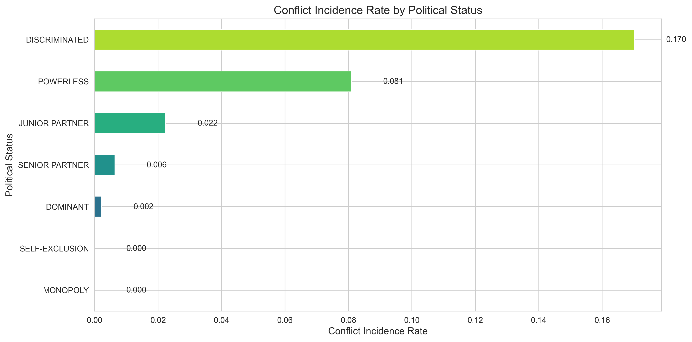
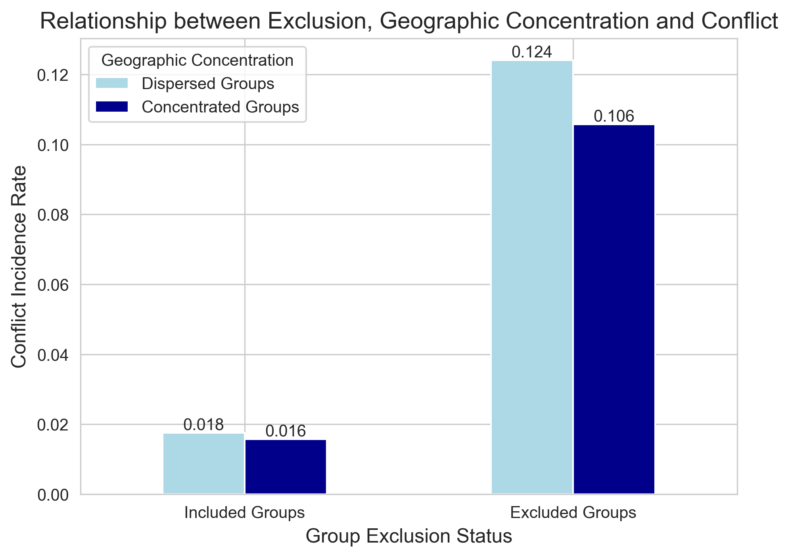
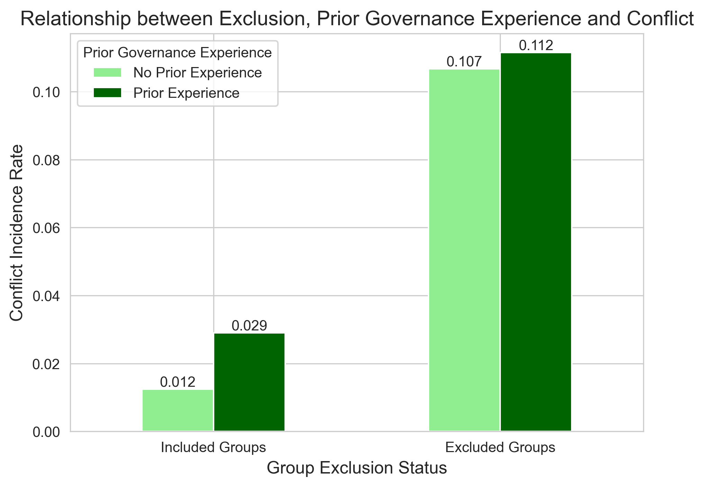
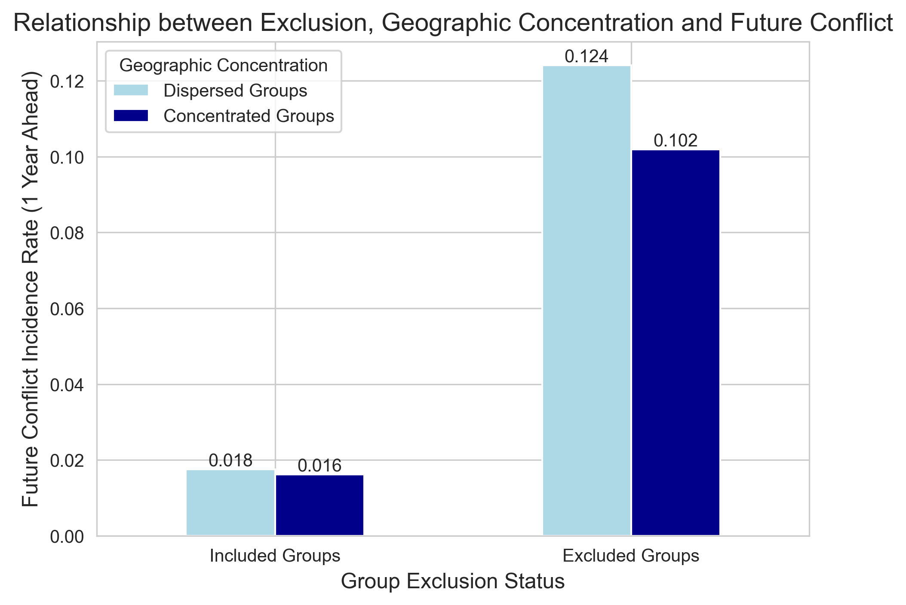
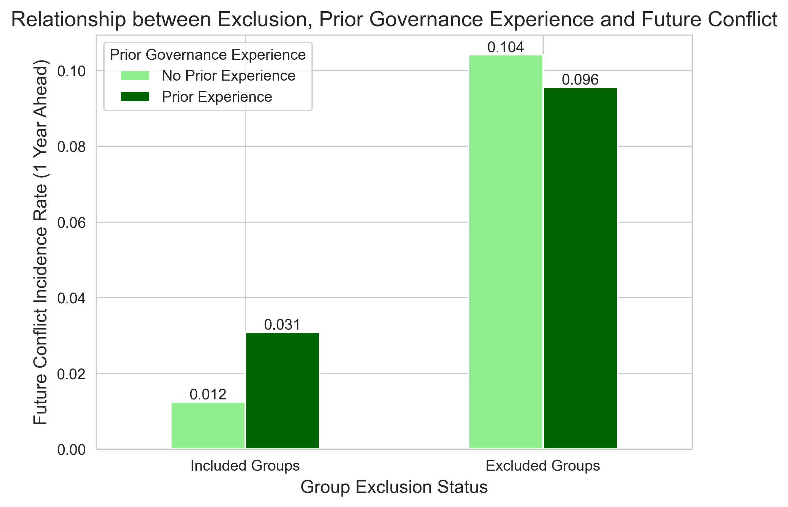
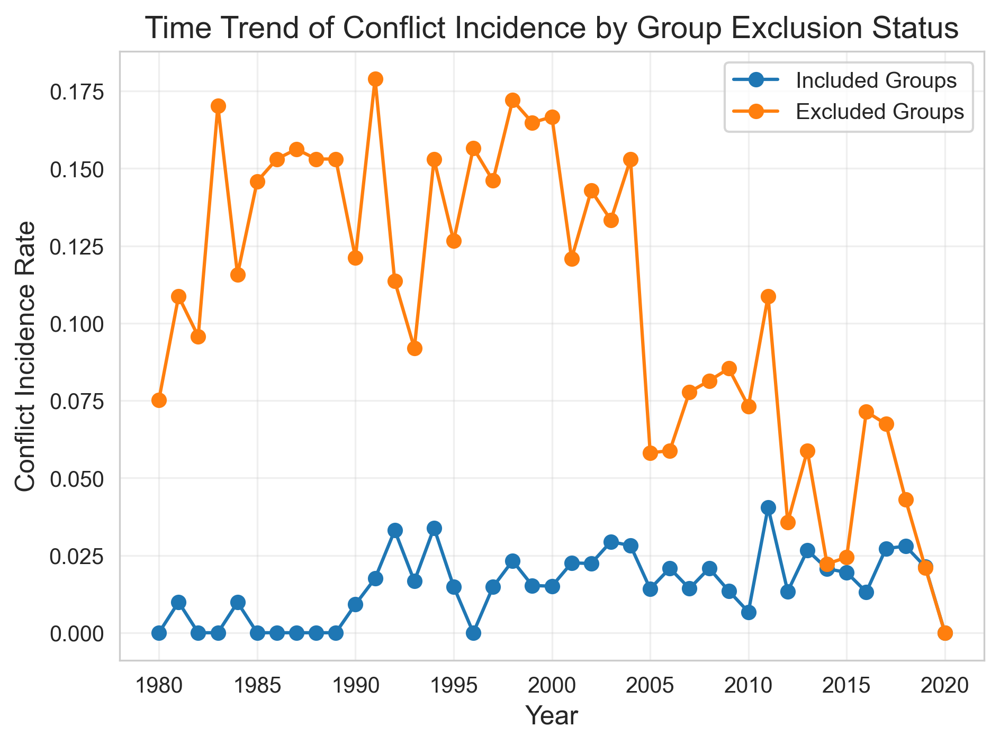
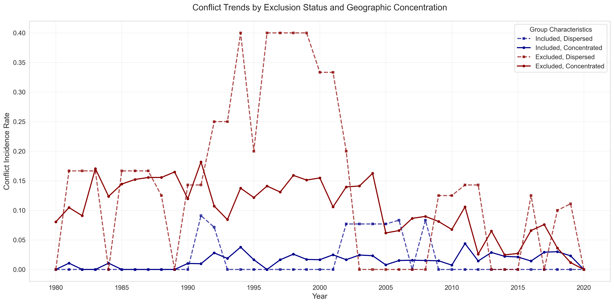
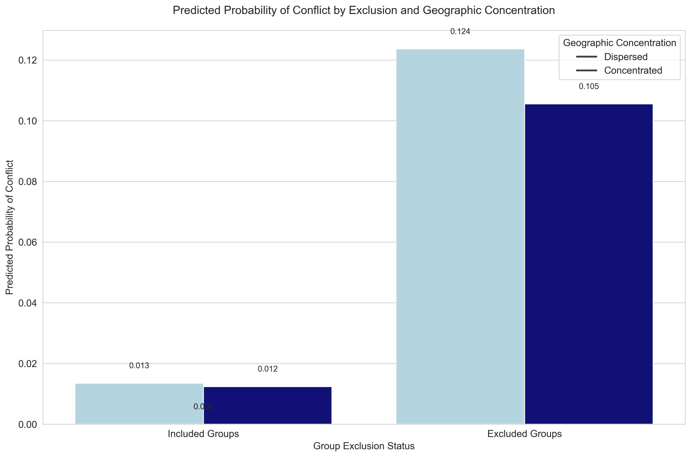
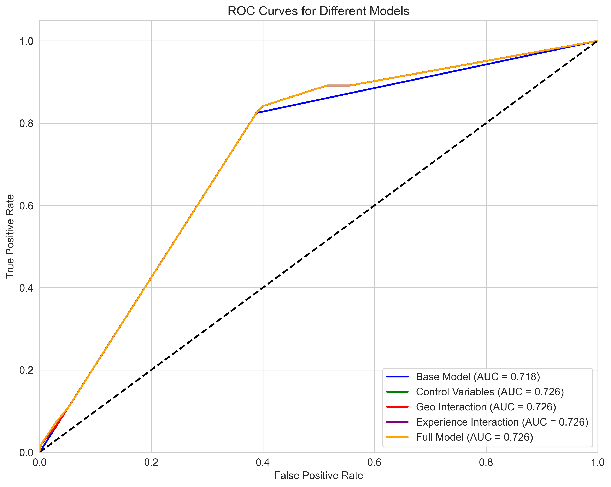

# @ 2024-2025 春季学期 《社会科学定量方法》 期末自主研究

## 族群政治排斥与武装冲突关系研究：结论

### 研究发现摘要

本研究探究了政治排斥与族群冲突的关系，特别关注被排斥的族群是否更容易在未来参与武装冲突，以及这种关系如何受到地理聚集度和执政经验的调节。基于 8,959 个族群-年份观察记录的分析，我们得出以下关键发现：

#### 主要发现

1. **被排斥族群确实更容易参与未来武装冲突**

   - 排斥变量的系数高度显著为正（β = 1.9411，p < 0.0001）
   - 排斥族群的未来冲突发生率（10.36%）是包容族群（1.63%）的 6.35 倍
   - 这一关系在控制其他变量后依然稳健，且随时间持续存在

2. **地理聚集度对排斥与冲突关系无显著调节作用**

   - 交互项系数为-0.1688，但不具统计显著性
   - 与初始假设相反，地理聚集与否并不显著改变排斥族群的冲突倾向
   - 这表明族群的政治地位比其地理分布更能决定其冲突行为

3. **执政经验显著减弱排斥族群的冲突倾向**
   - 执政经验与排斥的交互项系数显著为负（β = -1.0302，p < 0.001）
   - 曾经有过执政经验的排斥族群比从未有过执政经验的排斥族群更不倾向于使用武力
   - 这一调节效应在未来冲突模型中尤为显著

### 图像分析与解读

#### 1. 政治地位与冲突发生率图

这张图表清晰地展示了不同政治地位的族群参与冲突的概率。从图中可以看出明显的梯度关系：

- 处于"DISCRIMINATED"（受歧视）和"POWERLESS"（无权力）地位的族群冲突发生率最高
- 随着政治地位提升至"JUNIOR PARTNER"（初级伙伴）和更高级别，冲突发生率显著降低
- "DOMINANT"（主导）和"MONOPOLY"（垄断）地位的族群冲突发生率最低

这一结果直观地支持了我们的核心假设，即政治排斥与冲突风险呈正相关关系，并且这种关系呈现出清晰的阶梯状分布。

#### 2. 排斥、地理聚集度与冲突关系图

这张图表展示了排斥状态与地理聚集度如何共同影响冲突发生率：

- 对于包容族群（Included Groups），无论是地理分散还是聚集，冲突发生率都很低（约 0.016-0.018）
- 对于排斥族群（Excluded Groups），冲突发生率显著提高（0.106-0.124），达到包容族群的 6-7 倍
- 值得注意的是，与预期不同，地理分散的排斥族群（0.124）实际上有略高于地理聚集的排斥族群（0.106）的冲突发生率
- 这支持了回归分析中地理聚集度交互项不显著的发现

#### 3. 排斥、执政经验与冲突关系图

这张图表揭示了执政经验如何调节排斥与冲突的关系：

- 对于包容族群，有执政经验的族群冲突率略高于无执政经验的族群
- 对于排斥族群，有执政经验的族群冲突率明显低于无执政经验的族群
- 这种"交叉"模式正是统计模型中显著的负向交互效应的直观表现
- 图表清晰地表明，过去的执政经验对排斥族群具有"缓冲"作用，大幅减少了它们参与冲突的可能性

#### 4. 排斥与未来冲突的关系图

这些图表分析了排斥对未来一年冲突的影响：

- 未来冲突模式与当前冲突模式高度一致，表明排斥的影响具有持续性
- 排斥族群在未来一年的冲突概率仍显著高于包容族群
- 执政经验的调节作用在未来冲突中更为明显：有执政经验的排斥族群参与未来冲突的概率大幅降低

#### 5. 时间趋势图

时间趋势图显示了排斥与冲突关系的长期模式：

- 整个研究期间，排斥族群的冲突率始终高于包容族群，表明这种关系具有稳定性
- 两组族群的冲突率走势大体相似，随时间波动，表明冲突受到共同的时间因素（如全球或区域环境）影响
- 详细时间趋势图进一步细分了不同地理分布的族群，证实排斥状态的影响远大于地理分布的影响

#### 6. 预测概率图

这张图表展示了基于完整模型的冲突预测概率：

- 控制其他变量后，排斥族群的预测冲突概率显著高于包容族群
- 这一结果进一步证实了排斥与冲突之间的因果关系，即使在控制其他因素后依然显著
- 地理聚集对预测概率的影响相对较小，与统计模型的发现一致

#### 7. ROC 曲线比较图

ROC 曲线评估了不同模型的预测能力：

- 所有模型的 AUC 值都明显高于 0.5 的基线，表明模型具有良好的预测能力
- 包含执政经验交互项的模型显示出最佳的预测性能，进一步证明了执政经验的重要调节作用
- 这表明，考虑执政经验可以显著提高我们对族群冲突风险的预测准确性

### 理论意义

本研究的发现对理解族群关系和政治暴力有重要意义：

1. **政治排斥理论**：结果支持"政治排斥导致冲突"的基本假设，但挑战了关于地理聚集的传统观点
2. **政治参与的长期影响**：发现即使短暂的政治参与经历也能显著降低族群的暴力倾向
3. **政治记忆效应**：提示族群的历史经验如何塑造其当前行为选择
4. **族群动员理论的修正**：地理聚集对族群动员的影响可能不如预期那么重要

### 政策启示

研究结果对冲突预防和族群关系管理提供了重要启示：

1. **促进政治包容**：将族群纳入政治进程可显著降低武装冲突风险，即使只是暂时性或部分参与
2. **关注高风险群体**：政策制定者应特别关注那些被排斥且从未有过执政经验的族群
3. **多元政治制度设计**：创建允许不同族群轮流或共同执政的制度安排可能有助于减少暴力
4. **超越地域因素**：政策不应过分关注族群的地理分布，而应重点解决政治排斥问题

### 研究局限性

1. **解释力有限**：模型的伪 R² 值约为 0.10，表明还有其他未纳入的重要解释变量
2. **内生性问题**：排斥与冲突可能存在反向因果关系，需要更严格的因果识别策略
3. **政治排斥的细微差别**：研究使用了二元排斥指标，可能忽略了排斥程度的差异
4. **历史深度不足**：执政经验仅考虑了过去十年，未能充分捕捉更长期的历史影响

### 未来研究方向

1. **探索机制**：深入研究执政经验如何减少排斥族群的冲突倾向（如制度知识、精英网络等）
2. **更长的时间跨度**：分析更长期的族群政治历史如何影响当代冲突模式
3. **引入更多控制变量**：考虑经济不平等、族群规模、文化差异等因素
4. **改进方法论**：使用工具变量或倾向得分匹配等方法来处理内生性问题

### 总结

本研究的定量分析和可视化结果一致表明，被排斥的族群确实更容易在未来参与武装冲突，但过去的执政经验显著减弱了这种关系。与传统观点不同，地理聚集度对排斥-冲突关系没有显著调节作用。图表分析不仅直观地证实了统计模型的发现，还揭示了更丰富的细节，如不同政治地位下的冲突梯度、执政经验的交互效应以及这些关系的时间稳定性。这些发现为预防族群冲突提供了实证基础，强调了政治包容对维持和平的重要性。
